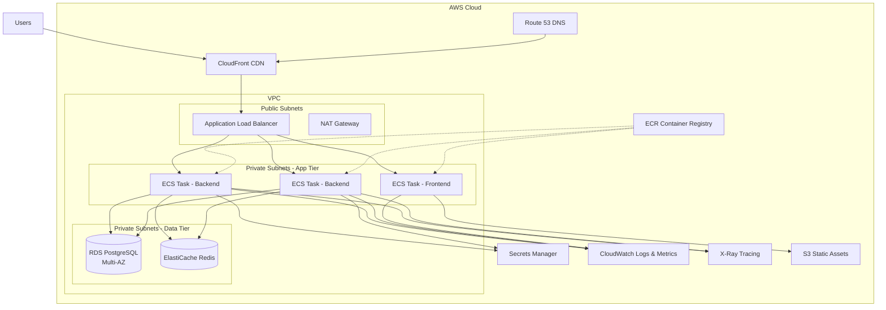

# Production Readiness Review - Family Calendar Application

**Review Date:** 2025-11-23  
**Target Environment:** AWS (ECS + RDS)  
**Reviewer:** Architecture Review

---

## Executive Summary

This document provides a comprehensive production readiness assessment of the Family Calendar application for deployment to AWS using ECS (Elastic Container Service) and RDS (Relational Database Service). The review identifies **critical**, **high**, and **medium** priority issues that must be addressed before production deployment.

**Overall Status:** ⚠️ **NOT PRODUCTION READY** - Multiple critical issues identified

---

## 🔴 Critical Issues (Must Fix Before Production)

### 1. Security Vulnerabilities

#### 1.1 Hardcoded Credentials in Docker Compose
**File:** [`docker-compose.yml`](docker-compose.yml:6-9)
```yaml
POSTGRES_DB: family_calendar
POSTGRES_USER: calendar_user
POSTGRES_PASSWORD: calendar_pass  # ❌ CRITICAL
```

**Impact:** Credentials are exposed in version control  
**Risk Level:** CRITICAL  
**Recommendation:**
- Use AWS Secrets Manager or Parameter Store for credentials
- Never commit credentials to version control
- Use environment variables with secure injection

#### 1.2 Weak Default Passwords
**File:** [`backend/.env.example`](backend/.env.example:2-3)

**Impact:** Default passwords are trivial and publicly visible  
**Risk Level:** CRITICAL  
**Recommendation:**
- Generate strong, random passwords for production
- Use AWS Secrets Manager rotation
- Implement password complexity requirements

#### 1.3 Overly Permissive CORS Configuration
**File:** [`backend/app/main.py`](backend/app/main.py:23-29)
```python
allow_origins=settings.BACKEND_CORS_ORIGINS,
allow_credentials=True,
allow_methods=["*"],  # ❌ Too permissive
allow_headers=["*"],  # ❌ Too permissive
```

**Impact:** Allows any method/header from configured origins  
**Risk Level:** HIGH  
**Recommendation:**
- Restrict to specific HTTP methods: `["GET", "POST", "PUT", "DELETE", "PATCH"]`
- Restrict headers to required ones: `["Content-Type", "Authorization"]`
- Use specific production domain instead of wildcards

#### 1.4 No Authentication/Authorization
**Files:** All API endpoints in [`backend/app/api/`](backend/app/api/)

**Impact:** Anyone can access, modify, or delete data  
**Risk Level:** CRITICAL  
**Recommendation:**
- Implement JWT-based authentication
- Add user management and multi-tenancy
- Use AWS Cognito for user authentication
- Implement role-based access control (RBAC)

#### 1.5 SQL Injection Risk (Partial)
**File:** [`backend/app/services/refresh_service.py`](backend/app/services/refresh_service.py:68-71)

**Current State:** Using SQLAlchemy ORM (good), but some raw queries exist  
**Risk Level:** MEDIUM  
**Recommendation:**
- Audit all database queries
- Ensure all user input is parameterized
- Add input validation middleware

### 2. Docker Configuration Issues

#### 2.1 Development Mode in Production Dockerfile
**File:** [`docker-compose.yml`](docker-compose.yml:38)
```bash
uvicorn app.main:app --host 0.0.0.0 --port 8042 --reload  # ❌ --reload flag
```

**Impact:** Auto-reload causes performance issues and instability  
**Risk Level:** CRITICAL  
**Recommendation:**
- Remove `--reload` flag for production
- Use production-grade WSGI server (Gunicorn with Uvicorn workers)
- Set appropriate worker count based on CPU cores

#### 2.2 Volume Mounts for Source Code
**File:** [`docker-compose.yml`](docker-compose.yml:33-34)
```yaml
volumes:
  - ./backend:/app  # ❌ Development only
```

**Impact:** Source code changes affect running containers  
**Risk Level:** HIGH  
**Recommendation:**
- Remove volume mounts in production
- Bake code into Docker image
- Use immutable container images

#### 2.3 Missing Multi-Stage Builds
**File:** [`backend/Dockerfile`](backend/Dockerfile:1-29)

**Impact:** Larger image size, includes build tools in production  
**Risk Level:** MEDIUM  
**Recommendation:**
- Implement multi-stage Docker builds
- Separate build and runtime dependencies
- Use slim base images for production

#### 2.4 Running as Root User
**Files:** [`backend/Dockerfile`](backend/Dockerfile), [`frontend/Dockerfile`](frontend/Dockerfile)

**Impact:** Security vulnerability if container is compromised  
**Risk Level:** HIGH  
**Recommendation:**
- Create non-root user in Dockerfile
- Use `USER` directive to switch to non-root user
- Set appropriate file permissions

#### 2.5 Port Mismatch
**File:** [`backend/Dockerfile`](backend/Dockerfile:29) vs [`docker-compose.yml`](docker-compose.yml:38)
```dockerfile
CMD ["uvicorn", "app.main:app", "--host", "0.0.0.0", "--port", "8000"]  # Port 8000
```
```yaml
uvicorn app.main:app --host 0.0.0.0 --port 8042 --reload  # Port 8042
```

**Impact:** Confusion and potential deployment issues  
**Risk Level:** MEDIUM  
**Recommendation:**
- Standardize on single port (8000 recommended)
- Use environment variable for port configuration

### 3. Database & Data Persistence

#### 3.1 No Database Connection Pooling Configuration
**File:** [`backend/app/core/database.py`](backend/app/core/database.py:8)
```python
engine = create_engine(settings.DATABASE_URL)  # ❌ No pool settings
```

**Impact:** Poor performance under load, connection exhaustion  
**Risk Level:** HIGH  
**Recommendation:**
```python
engine = create_engine(
    settings.DATABASE_URL,
    pool_size=20,
    max_overflow=10,
    pool_pre_ping=True,
    pool_recycle=3600
)
```

#### 3.2 No Database Migration Strategy
**Current State:** Migrations run on container startup  
**Risk Level:** HIGH  
**Recommendation:**
- Run migrations as separate ECS task before deployment
- Implement blue-green deployment strategy
- Add migration rollback procedures
- Version control migration state

#### 3.3 Missing Database Indexes
**Files:** [`backend/app/models/event.py`](backend/app/models/event.py), [`backend/app/models/calendar.py`](backend/app/models/calendar.py)

**Impact:** Slow queries as data grows  
**Risk Level:** MEDIUM  
**Recommendation:**
- Add indexes on frequently queried fields:
  - `events.start_time`, `events.end_time`
  - `events.calendar_id` (already has FK index)
  - Composite index on `(calendar_id, start_time)`

#### 3.4 No Database Backup Strategy
**Impact:** Data loss risk  
**Risk Level:** CRITICAL  
**Recommendation:**
- Enable RDS automated backups (30-day retention)
- Configure point-in-time recovery
- Set up cross-region backup replication
- Test restore procedures regularly

#### 3.5 No Connection Retry Logic
**File:** [`backend/app/core/database.py`](backend/app/core/database.py:17-22)

**Impact:** Application crashes if database is temporarily unavailable  
**Risk Level:** HIGH  
**Recommendation:**
- Implement connection retry with exponential backoff
- Add circuit breaker pattern
- Handle database connection errors gracefully

### 4. Application Reliability & Error Handling

#### 4.1 Insufficient Error Handling in External API Calls
**File:** [`backend/app/services/ical_service.py`](backend/app/services/ical_service.py:28-36)
```python
response = requests.get(url, timeout=10)  # ❌ No retry logic
```

**Impact:** Calendar refresh fails on transient network issues  
**Risk Level:** MEDIUM  
**Recommendation:**
- Implement retry logic with exponential backoff
- Use `requests` with `urllib3.Retry`
- Add circuit breaker for failing calendars
- Implement timeout strategies

#### 4.2 Scheduler Reliability Issues
**File:** [`backend/app/services/refresh_service.py`](backend/app/services/refresh_service.py:160-182)

**Impact:** Scheduled jobs may not survive container restarts  
**Risk Level:** HIGH  
**Recommendation:**
- Use AWS EventBridge (CloudWatch Events) for scheduling
- Implement idempotent refresh operations
- Add job status tracking in database
- Use distributed task queue (SQS + Lambda or ECS tasks)

#### 4.3 No Health Check Endpoint for Application State
**File:** [`backend/app/main.py`](backend/app/main.py:35-37)
```python
@app.get("/health")
def health_check():
    return {"status": "ok"}  # ❌ Doesn't check dependencies
```

**Impact:** ECS may route traffic to unhealthy containers  
**Risk Level:** HIGH  
**Recommendation:**
- Add database connectivity check
- Check external service availability
- Return proper HTTP status codes (503 for unhealthy)
- Implement separate liveness and readiness probes

#### 4.4 Deprecated FastAPI Event Handlers
**File:** [`backend/app/main.py`](backend/app/main.py:40-51)
```python
@app.on_event("startup")  # ❌ Deprecated in FastAPI
@app.on_event("shutdown")  # ❌ Deprecated in FastAPI
```

**Impact:** May break in future FastAPI versions  
**Risk Level:** MEDIUM  
**Recommendation:**
- Use lifespan context manager (FastAPI 0.93+)
- Implement proper async context management

#### 4.5 No Request Timeout Configuration
**Impact:** Long-running requests can exhaust resources  
**Risk Level:** MEDIUM  
**Recommendation:**
- Configure request timeouts in Uvicorn/Gunicorn
- Add timeout middleware
- Implement request rate limiting

### 5. Monitoring, Logging & Observability

#### 5.1 Basic Logging Configuration
**File:** [`backend/app/main.py`](backend/app/main.py:10-13)
```python
logging.basicConfig(
    level=logging.INFO,
    format="%(asctime)s - %(name)s - %(levelname)s - %(message)s",
)  # ❌ Not production-ready
```

**Impact:** Difficult to debug production issues  
**Risk Level:** HIGH  
**Recommendation:**
- Use structured logging (JSON format)
- Integrate with AWS CloudWatch Logs
- Add correlation IDs for request tracing
- Include contextual information (user, request_id, etc.)
- Configure log levels via environment variables

#### 5.2 No Application Metrics
**Impact:** Cannot monitor application performance  
**Risk Level:** HIGH  
**Recommendation:**
- Add Prometheus metrics endpoint
- Track key metrics:
  - Request rate, latency, error rate
  - Database query performance
  - Calendar refresh success/failure rates
  - Active connections
- Use AWS CloudWatch custom metrics
- Implement APM (Application Performance Monitoring)

#### 5.3 No Distributed Tracing
**Impact:** Difficult to debug issues across services  
**Risk Level:** MEDIUM  
**Recommendation:**
- Implement AWS X-Ray
- Add OpenTelemetry instrumentation
- Track request flows across services

#### 5.4 No Error Tracking
**Impact:** Production errors go unnoticed  
**Risk Level:** HIGH  
**Recommendation:**
- Integrate Sentry or similar error tracking
- Set up alerting for critical errors
- Track error rates and patterns

### 6. Performance & Scalability

#### 6.1 Synchronous External API Calls
**File:** [`backend/app/services/ical_service.py`](backend/app/services/ical_service.py:28-36)
```python
response = requests.get(url, timeout=10)  # ❌ Blocking call
```

**Impact:** Blocks event loop, reduces throughput  
**Risk Level:** MEDIUM  
**Recommendation:**
- Use `httpx` with async support
- Implement connection pooling
- Use async/await throughout

#### 6.2 No Caching Strategy
**Impact:** Repeated expensive operations  
**Risk Level:** MEDIUM  
**Recommendation:**
- Implement Redis/ElastiCache for caching
- Cache calendar data between refreshes
- Add HTTP caching headers
- Cache database query results

#### 6.3 N+1 Query Problem
**File:** [`backend/app/api/events.py`](backend/app/api/events.py:14-46)

**Impact:** Multiple database queries for related data  
**Risk Level:** MEDIUM  
**Recommendation:**
- Use SQLAlchemy `joinedload` or `selectinload`
- Optimize queries with proper eager loading
- Add query performance monitoring

#### 6.4 No Rate Limiting
**Impact:** API abuse, DDoS vulnerability  
**Risk Level:** HIGH  
**Recommendation:**
- Implement rate limiting middleware
- Use AWS WAF for DDoS protection
- Add per-user/IP rate limits
- Use AWS API Gateway if applicable

#### 6.5 Large Event Expansion in Memory
**File:** [`backend/app/services/ical_service.py`](backend/app/services/ical_service.py:82-106)
```python
until = now + timedelta(days=90)  # Expands 90 days of recurring events
```

**Impact:** Memory issues with many recurring events  
**Risk Level:** MEDIUM  
**Recommendation:**
- Implement pagination for event expansion
- Store recurrence rules, expand on-demand
- Add configurable expansion window
- Consider lazy loading for recurring events

### 7. Configuration Management

#### 7.1 No Environment-Specific Configuration
**File:** [`backend/app/core/config.py`](backend/app/core/config.py:9-26)

**Impact:** Same config for dev/staging/prod  
**Risk Level:** HIGH  
**Recommendation:**
- Use Pydantic Settings with environment validation
- Separate configs for each environment
- Use AWS Systems Manager Parameter Store
- Implement configuration validation on startup

#### 7.2 Missing Required Environment Variables
**Impact:** Application may fail to start  
**Risk Level:** MEDIUM  
**Recommendation:**
- Add environment variable validation
- Fail fast on missing required configs
- Document all required variables
- Use `.env.example` as template

#### 7.3 No Secret Rotation Strategy
**Impact:** Compromised secrets remain valid indefinitely  
**Risk Level:** HIGH  
**Recommendation:**
- Use AWS Secrets Manager with automatic rotation
- Implement secret rotation procedures
- Update application to handle secret rotation

### 8. Deployment & CI/CD

#### 8.1 No CI/CD Pipeline
**Impact:** Manual deployments are error-prone  
**Risk Level:** HIGH  
**Recommendation:**
- Implement GitHub Actions or AWS CodePipeline
- Automate testing, building, and deployment
- Add automated security scanning
- Implement deployment gates

#### 8.2 No Automated Testing
**Impact:** Bugs reach production  
**Risk Level:** HIGH  
**Recommendation:**
- Add unit tests (pytest)
- Add integration tests
- Add API contract tests
- Implement test coverage requirements (>80%)
- Add pre-commit hooks

#### 8.3 No Container Image Scanning
**Impact:** Vulnerable dependencies in production  
**Risk Level:** HIGH  
**Recommendation:**
- Use AWS ECR image scanning
- Integrate Trivy or Snyk
- Block deployment of vulnerable images
- Regular dependency updates

#### 8.4 No Rollback Strategy
**Impact:** Difficult to recover from bad deployments  
**Risk Level:** HIGH  
**Recommendation:**
- Implement blue-green deployments
- Use ECS deployment circuit breaker
- Tag images with version/commit SHA
- Document rollback procedures

---

## 🟡 Medium Priority Issues

### 9. Code Quality & Maintainability

#### 9.1 Missing Type Hints
**Impact:** Reduced code maintainability  
**Recommendation:** Add comprehensive type hints throughout codebase

#### 9.2 No API Versioning
**File:** [`backend/app/api/__init__.py`](backend/app/api/__init__.py:10-11)  
**Recommendation:** Implement API versioning (`/api/v1/`)

#### 9.3 Inconsistent Error Responses
**Recommendation:** Standardize error response format across all endpoints

#### 9.4 No Request Validation Middleware
**Recommendation:** Add comprehensive input validation using Pydantic

#### 9.5 Missing API Documentation
**Recommendation:** Enhance OpenAPI/Swagger documentation with examples

### 10. Frontend Considerations

#### 10.1 Development Server in Production
**File:** [`frontend/Dockerfile`](frontend/Dockerfile:18)
```dockerfile
CMD ["npm", "start"]  # ❌ Development server
```

**Recommendation:**
- Build static assets: `npm run build`
- Serve with nginx or CloudFront
- Implement proper caching headers

#### 10.2 No Environment Configuration
**Recommendation:**
- Use environment variables for API endpoint
- Implement runtime configuration
- Use AWS CloudFront for CDN

---

## 📋 Production Readiness Checklist

### Security
- [ ] Remove hardcoded credentials
- [ ] Implement authentication/authorization
- [ ] Configure AWS Secrets Manager
- [ ] Restrict CORS to production domains
- [ ] Enable HTTPS/TLS everywhere
- [ ] Implement rate limiting
- [ ] Add security headers
- [ ] Enable AWS WAF
- [ ] Implement audit logging
- [ ] Regular security scanning

### Infrastructure
- [ ] Configure RDS with Multi-AZ
- [ ] Enable RDS automated backups
- [ ] Set up VPC with private subnets
- [ ] Configure security groups properly
- [ ] Set up Application Load Balancer
- [ ] Configure auto-scaling for ECS
- [ ] Enable CloudWatch monitoring
- [ ] Set up CloudWatch alarms
- [ ] Configure log aggregation
- [ ] Implement disaster recovery plan

### Application
- [ ] Fix Docker configuration for production
- [ ] Implement proper health checks
- [ ] Add database connection pooling
- [ ] Implement retry logic
- [ ] Add structured logging
- [ ] Configure application metrics
- [ ] Implement caching strategy
- [ ] Add request timeouts
- [ ] Optimize database queries
- [ ] Update deprecated code

### Deployment
- [ ] Create Terraform infrastructure code
- [ ] Set up CI/CD pipeline
- [ ] Implement automated testing
- [ ] Add container image scanning
- [ ] Configure blue-green deployment
- [ ] Document deployment procedures
- [ ] Create rollback procedures
- [ ] Set up staging environment
- [ ] Implement deployment gates
- [ ] Create runbooks for operations

### Monitoring & Operations
- [ ] Set up CloudWatch dashboards
- [ ] Configure alerting rules
- [ ] Implement error tracking (Sentry)
- [ ] Add distributed tracing (X-Ray)
- [ ] Create operational runbooks
- [ ] Document incident response
- [ ] Set up on-call rotation
- [ ] Implement log retention policies
- [ ] Create backup/restore procedures
- [ ] Regular disaster recovery testing

---

## 🎯 Recommended Implementation Priority

### Phase 1: Critical Security & Stability (Week 1-2)
1. Remove hardcoded credentials, use AWS Secrets Manager
2. Fix Docker configuration (remove --reload, volume mounts)
3. Implement proper health checks
4. Add database connection pooling
5. Configure production logging
6. Implement authentication/authorization

### Phase 2: Infrastructure & Deployment (Week 2-3)
1. Create Terraform code for AWS infrastructure
2. Set up RDS with proper configuration
3. Configure ECS with auto-scaling
4. Set up Application Load Balancer
5. Implement CI/CD pipeline
6. Add automated testing

### Phase 3: Reliability & Performance (Week 3-4)
1. Implement retry logic and circuit breakers
2. Add caching layer (ElastiCache)
3. Optimize database queries and indexes
4. Implement rate limiting
5. Add monitoring and alerting
6. Set up error tracking

### Phase 4: Production Hardening (Week 4-5)
1. Implement distributed tracing
2. Add comprehensive metrics
3. Create operational runbooks
4. Implement disaster recovery
5. Security hardening and penetration testing
6. Load testing and performance optimization

---

## 📊 Architecture Diagram for AWS Deployment



---

## 🔧 Recommended Technology Additions

### Backend
- **Gunicorn** - Production WSGI server
- **httpx** - Async HTTP client
- **redis** - Caching and session storage
- **sentry-sdk** - Error tracking
- **prometheus-client** - Metrics
- **python-json-logger** - Structured logging
- **tenacity** - Retry logic
- **pydantic-settings** - Configuration management

### Infrastructure
- **Terraform** - Infrastructure as Code
- **AWS RDS** - Managed PostgreSQL
- **AWS ElastiCache** - Redis caching
- **AWS Secrets Manager** - Secret management
- **AWS CloudWatch** - Logging and monitoring
- **AWS X-Ray** - Distributed tracing
- **AWS WAF** - Web application firewall
- **AWS CloudFront** - CDN

### DevOps
- **GitHub Actions** - CI/CD
- **Trivy** - Container scanning
- **pytest** - Testing framework
- **black** - Code formatting
- **flake8** - Linting
- **mypy** - Type checking

---

## 💰 Estimated AWS Costs (Monthly)

### Minimum Production Setup
- **RDS (db.t3.medium, Multi-AZ):** ~$120
- **ECS Fargate (2 backend, 1 frontend):** ~$100
- **Application Load Balancer:** ~$25
- **ElastiCache (cache.t3.micro):** ~$15
- **CloudWatch Logs & Metrics:** ~$20
- **Data Transfer:** ~$20
- **Secrets Manager:** ~$2
- **Total:** ~$300-350/month

### Recommended Production Setup
- **RDS (db.t3.large, Multi-AZ):** ~$240
- **ECS Fargate (4 backend, 2 frontend):** ~$200
- **Application Load Balancer:** ~$25
- **ElastiCache (cache.t3.small):** ~$30
- **CloudWatch + X-Ray:** ~$50
- **CloudFront:** ~$20
- **WAF:** ~$10
- **Total:** ~$575-625/month

---

## 📚 Next Steps

1. **Review this document** with your team
2. **Prioritize fixes** based on your timeline
3. **Create detailed implementation plan** for each phase
4. **Set up AWS account** and configure IAM roles
5. **Begin Phase 1** critical security fixes
6. **Request Terraform infrastructure code** creation
7. **Set up CI/CD pipeline** early in the process
8. **Implement monitoring** before production deployment
9. **Conduct security review** before go-live
10. **Perform load testing** to validate scalability

---

## 🤝 Support & Questions

This review provides a comprehensive roadmap to production readiness. Each issue includes specific recommendations and code examples. When you're ready to implement these changes, we can work through them systematically, starting with the critical security and stability fixes.

Would you like me to help you create the Terraform infrastructure code or implement any of these recommendations?